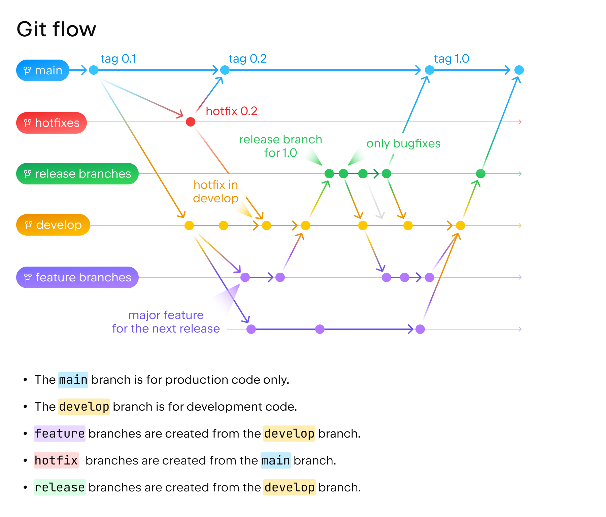

# Visilant Visual Acuity API

This project using [Nest](https://github.com/nestjs/nest) framework with TypeScript.
---
## Table of Contents

- [Visilant Visual Acuity API](#visilant-visual-acuity-api)
  - [This project using Nest framework with TypeScript.](#this-project-using-nest-framework-with-typescript)
  - [Table of Contents](#table-of-contents)
  - [Getting Started](#getting-started)
    - [Prerequisites](#prerequisites)
    - [Installing Dependencies](#installing-dependencies)
    - [Setting up MySQL](#setting-up-mysql)
      - [Installation on macOS](#installation-on-macos)
  - [Development](#development)
    - [Running the app](#running-the-app)
    - [Testing](#testing)
      - [Test Coverage](#test-coverage)
      - [Commands](#commands)
    - [Branching Strategy](#branching-strategy)
    - [Deployment - **TODO**](#deployment---todo)
    - [Clean Code Principles](#clean-code-principles)
    - [Husky Git Hooks](#husky-git-hooks)
    - [Pre-Commit Hook](#pre-commit-hook)
    - [Pre-Push Hook (Optional)](#pre-push-hook-optional)

---
## Getting Started

### Prerequisites

Before you begin, ensure you have met the following requirements:

- Node.js and npm installed (Node.js version >= 14 recommended)
- Git installed
- MySQL Server installed

### Installing Dependencies

To install project dependencies, run the following command:

```bash
npm install
```

### Setting up MySQL

#### Installation on macOS

1. Homebrew Installation (if Homebrew is not already installed):
If you don't have Homebrew installed, you can install it by running the following command:

```bash
/bin/bash -c "$(curl -fsSL https://raw.githubusercontent.com/Homebrew/install/HEAD/install.sh)"
```

2. MySQL Installation:
    Use Homebrew to install MySQL:

```bash
brew install mysql
```

3. Start MySQL Server:
To start the MySQL server, use the following command:

```bash
brew services start mysql
```

4. Create `visilantva` Database:
Use the MySQL client to create a database for your Nest.js application:

```bash
mysql -u root -p
```


```SQL
CREATE DATABASE visilantva;
```

---
## Development


### Running the app

After the successful setup you can run the application with the following commands:

```bash
# create environment variable
$ cp .env.example .env

# development
$ yarn run start

# watch mode
$ yarn run start:dev

# production mode
$ yarn run start:prod
```

---

### Testing

We follow a file naming convention that ends test files with .spec.ts or .spec.js. This naming convention allows Jest to automatically discover and run your tests.


#### Test Coverage

We aim for a high level of test coverage to ensure the stability of our codebase. After running the tests, you can check the test coverage summary in the coverage directory. Open the generated index.html file in your browser to view detailed coverage reports.


#### Commands

```bash
# unit tests
$ yarn run test

# e2e tests
$ yarn run test:e2e

# test coverage
$ yarn run test:cov
```

### Branching Strategy

We follow the Gitflow branching strategy for our development process. This strategy consists of the following branches:



main: Represents the production-ready code.

dev: The main development branch where feature branches are merged.

feat/feature-name: Feature branches for adding new features.

hotfix/hotfix-name: Hotfix branches for critical bug fixes.
Here is how you can use these branches:

Start a new feature: git checkout -b feat/your-feature-name

Start a new hotfix: git checkout -b hotfix/your-hotfix-name

Remember to follow this branching model to keep your codebase organized and to manage feature and bug fixes effectively

---

### Deployment - **TODO**

---

### Clean Code Principles

In this project, we adhere to the principles of clean code. Clean code is not just about writing code that works but also about making it understandable and maintainable. It's a philosophy that emphasizes writing code that is easy to read, easy to understand, and easy to maintain. Some of the key principles we follow include:

- **Meaningful Variable and Function Names**: We use descriptive names for variables, functions, and classes to ensure that the code's intent is clear.

- **Single Responsibility Principle (SRP)**: Each component or module is responsible for a single, well-defined aspect of the system, making it easier to understand and maintain.

- **Don't Repeat Yourself (DRY)**: We strive to eliminate duplicate code and promote code reusability.

- **Consistent Code Style**: We maintain a consistent code style and formatting throughout the project to enhance readability.

- **Regular Refactoring**: We continuously improve the code by refactoring when necessary, ensuring it stays clean and maintainable.

By following these clean code principles, we aim to create a codebase that is not only functional but also a pleasure to work with for the entire development team.

---

### Husky Git Hooks

We've integrated [Husky](https://typicode.github.io/husky) into this project to help maintain code quality and consistency by running tasks and checks on specified Git hooks. This ensures that certain scripts or checks are executed automatically at appropriate points in your Git workflow.

### Pre-Commit Hook

The pre-commit hook runs just before a commit is created. It's an excellent opportunity to perform checks to ensure that the code being committed meets certain quality standards.

In this project, we use the pre-commit hook for tasks such as:

- Running lint checks to enforce coding style and consistency.
- Executing unit tests to ensure the codebase remains stable.

This ensures that every commit to the repository meets our quality standards.

### Pre-Push Hook (Optional)

You can also set up a pre-push hook, which runs just before you push your code to the remote repository. This is optional and can be used for additional checks or tasks that should pass before changes are pushed.

To configure or customize Husky hooks for your specific project requirements, you can modify the `.husky/pre-commit` file in the project's root.